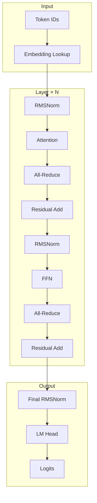
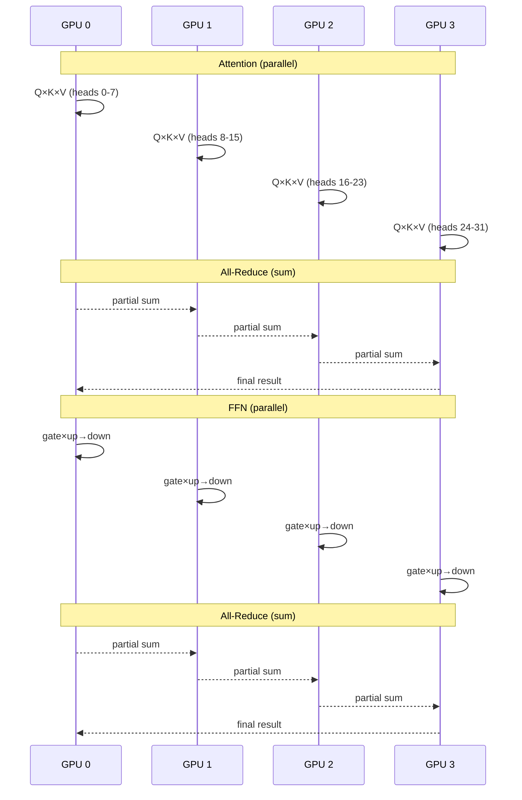

# Tensor Parallelism Architecture

This document explains the design decisions and architecture of the tensor parallelism implementation.

## Design Philosophy

The implementation prioritizes:
1. **Correctness** - Proper transformer operations (RMSNorm, softmax, RoPE)
2. **Simplicity** - Direct MLIR/StableHLO construction over complex abstractions
3. **Performance** - Pre-allocated KV cache, minimal all-reduce communication
4. **Compatibility** - Works with existing Bumblebee model loading

## Key Design Decisions

### 1. Why EXLA SPMD over Manual Device Placement

**Choice:** Use `EXLA.SPMD.build/4` for multi-device execution

**Alternatives considered:**
- Manual `Nx.backend_transfer/2` to each device
- Custom NCCL bindings with explicit communication
- Nx.Defn with device annotations

**Why SPMD:**
```elixir
# SPMD approach - single graph, multiple replicas
spmd = EXLA.SPMD.build(input_typespecs, output_typespecs, fn builder ->
  # Same code runs on all GPUs
  # All-reduce handled automatically
end, num_replicas: 4)

# Run on all GPUs simultaneously
EXLA.SPMD.run(spmd, replica_inputs)
```

Benefits:
- XLA handles device placement and data transfer
- Single graph construction, no manual synchronization
- StableHLO all-reduce maps directly to NCCL
- Consistent with JAX/PyTorch FSDP patterns

### 2. Why StableHLO All-Reduce over Custom NCCL Bindings

**Choice:** Use `EXLA.MLIR.Value.all_reduce/5` (StableHLO op)

**Alternatives considered:**
- Direct NCCL NIF bindings
- Custom collective ops in Nx.Defn

**Why StableHLO:**
```elixir
# StableHLO all-reduce
result = Value.all_reduce(
  partial_output,
  :sum,                    # Reduction operation
  [[0, 1, 2, 3]],         # Replica groups
  channel_id,              # For ordering
  output_typespec
)
```

Benefits:
- XLA automatically uses NCCL on CUDA platforms
- Handles buffer management and synchronization
- Supports all NCCL operations (sum, max, min, etc.)
- Future-proof for TPU and other backends

### 3. Column-Parallel vs Row-Parallel Layers

**Architecture follows Megatron-LM pattern:**

```
ATTENTION:
┌─────────────────────────────────────────────────────────────────┐
│                      Column-Parallel                             │
│  ┌────────────────────────────────────────────────────────┐     │
│  │  Q, K, V Projections: Split output dimension (heads)   │     │
│  │                                                         │     │
│  │  Full W_q: [hidden, num_heads × head_dim]              │     │
│  │  GPU 0:    [hidden, local_heads × head_dim]            │     │
│  │  GPU 1:    [hidden, local_heads × head_dim]            │     │
│  │  ...                                                    │     │
│  └────────────────────────────────────────────────────────┘     │
│                              │                                   │
│                    Local Attention                               │
│                              │                                   │
│  ┌────────────────────────────────────────────────────────┐     │
│  │  O Projection: Row-parallel (split input dimension)    │     │
│  │                                                         │     │
│  │  Full W_o: [num_heads × head_dim, hidden]              │     │
│  │  GPU 0:    [local_heads × head_dim, hidden]            │     │
│  │  Each GPU produces partial [batch, seq, hidden]        │     │
│  └────────────────────────────────────────────────────────┘     │
│                              │                                   │
│                    ALL-REDUCE (sum)                              │
└─────────────────────────────────────────────────────────────────┘

FFN (SwiGLU):
┌─────────────────────────────────────────────────────────────────┐
│                      Column-Parallel                             │
│  ┌────────────────────────────────────────────────────────┐     │
│  │  Gate & Up: Split output dimension (intermediate)      │     │
│  │                                                         │     │
│  │  Full W_gate: [hidden, intermediate]                   │     │
│  │  GPU 0:       [hidden, local_intermediate]             │     │
│  └────────────────────────────────────────────────────────┘     │
│                              │                                   │
│                    Local SiLU(gate) × up                         │
│                              │                                   │
│  ┌────────────────────────────────────────────────────────┐     │
│  │  Down: Row-parallel (split input dimension)            │     │
│  │                                                         │     │
│  │  Full W_down: [intermediate, hidden]                   │     │
│  │  GPU 0:       [local_intermediate, hidden]             │     │
│  └────────────────────────────────────────────────────────┘     │
│                              │                                   │
│                    ALL-REDUCE (sum)                              │
└─────────────────────────────────────────────────────────────────┘
```

**Why this pattern:**
- Minimizes all-reduce calls (once per attention, once per FFN)
- Each GPU computes full hidden dimension output
- Sum reduction combines partial results correctly

### 4. Embedding: Replication vs Sharding

**Choice:** Replicate embedding table on all GPUs

**Alternatives considered:**
- Shard vocabulary across GPUs
- Use all-gather after lookup

**Why replication:**
```
Embedding size for Qwen3-4B:
  vocab_size × hidden = 151,936 × 2560 = 389M params
  In f32: 1.45 GB per GPU (replicated)

Layer params (sharded):
  Per layer: ~100M params
  36 layers: 3.6B params
  Per GPU: ~900M params = 3.4 GB
```

Benefits:
- No communication for embedding lookup
- Simpler implementation
- Embedding is small relative to transformer layers

Trade-off:
- ~4× memory overhead for embedding (1.45 GB × 4 = 5.8 GB total vs 1.45 GB if sharded)
- Acceptable for models up to 70B parameters

### 5. GQA Head Distribution Strategy

**Grouped Query Attention (GQA):** More Q heads than KV heads

```
Qwen3-4B: 32 Q heads, 8 KV heads (4:1 ratio)

Distribution with TP=4:
┌─────────────────────────────────────────────────────────────────┐
│  GPU 0        GPU 1        GPU 2        GPU 3                   │
│  ───────────────────────────────────────────────────            │
│  Q: 8 heads   Q: 8 heads   Q: 8 heads   Q: 8 heads             │
│  K: 2 heads   K: 2 heads   K: 2 heads   K: 2 heads             │
│  V: 2 heads   V: 2 heads   V: 2 heads   V: 2 heads             │
│                                                                  │
│  kv_head_repeat = Q_heads / KV_heads = 8 / 2 = 4               │
│  Each KV head serves 4 Q heads                                  │
└─────────────────────────────────────────────────────────────────┘
```

**Implementation:**
```elixir
# Head dimensions
local_heads = num_heads / tp_size           # 32/4 = 8
local_kv_heads = num_kv_heads / tp_size     # 8/4 = 2
kv_head_repeat = local_heads / local_kv_heads  # 8/2 = 4

# In attention, broadcast KV to match Q
# K: [batch, local_kv_heads, seq, head_dim]
# K_expanded: [batch, local_kv_heads, kv_head_repeat, seq, head_dim]
# Reshape to: [batch, local_heads, seq, head_dim]
```

### 6. KV Cache Architecture

**Choice:** Pre-allocated fixed-size cache with dynamic_update_slice

**Alternatives considered:**
- Dynamic cache growth (recompile each step)
- Paged attention (PagedAttention)

**Why pre-allocated:**
```elixir
# Pre-allocate for max_seq_len
k_cache_shape = {batch, local_kv_heads, max_seq_len, head_dim}
v_cache_shape = {batch, local_kv_heads, max_seq_len, head_dim}

# Update at position (no recompilation)
k_cache = Value.dynamic_update_slice(
  k_cache_in,
  k_new,
  [zero, zero, position, zero],  # Update at position
  k_cache_typespec
)
```

Benefits:
- Single SPMD compilation for decode phase
- O(1) cache update via dynamic_update_slice
- Position-based attention masking handles valid range

Trade-off:
- Memory allocated for max_seq_len even if unused
- Acceptable for known maximum context lengths

## Architecture Diagrams

### Mermaid: Data Flow



### Mermaid: GPU Communication



## File Structure

```
exla/
├── lib/exla/
│   ├── spmd.ex              # SPMD build/run API
│   ├── mlir/
│   │   └── value.ex         # all_reduce, dynamic_update_slice
│   └── collective.ex        # replica_groups helper

bumblebee/
├── examples/
│   ├── tp_4gpu_qwen3.exs    # Qwen3 TP implementation
│   └── tp_4gpu_generate_final.exs  # Mistral TP implementation
└── docs/tensor_parallelism/
    └── (this documentation)
```

## Summary

| Decision | Choice | Rationale |
|----------|--------|-----------|
| Execution model | EXLA SPMD | XLA handles device placement, single graph |
| Communication | StableHLO all-reduce | Maps to NCCL, future backend support |
| Attention | Column→Row parallel | Minimize all-reduce, correct math |
| FFN | Column→Row parallel | Same pattern as attention |
| Embedding | Replicated | Small overhead, no communication |
| KV Cache | Pre-allocated | No recompilation per token |
